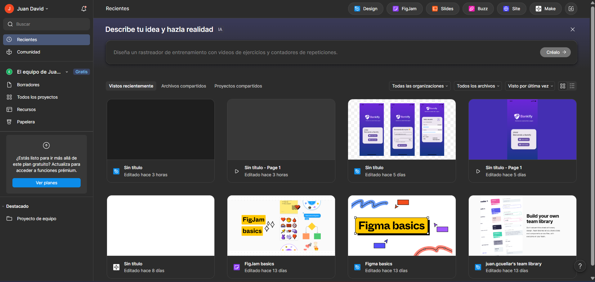
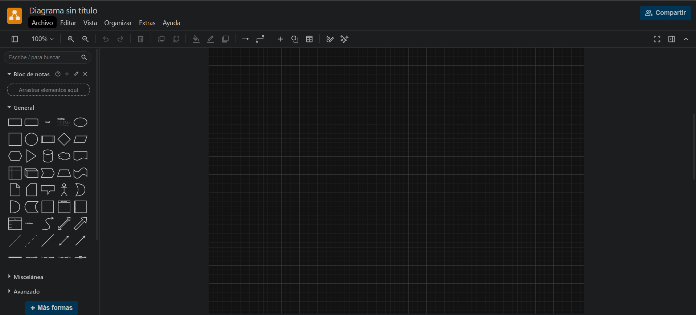
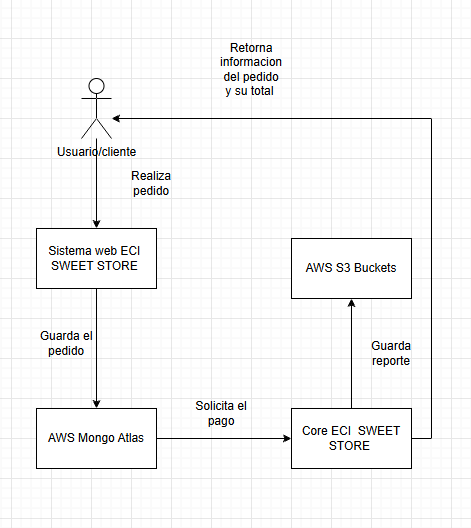
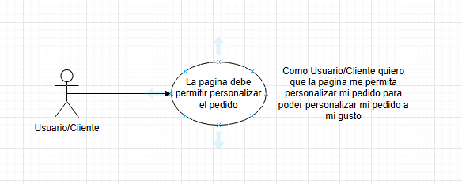
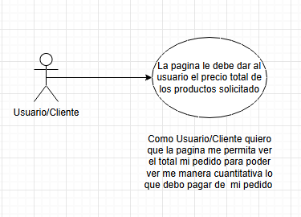

# DOSW2_ParcialT1_Juan David Gomez Cuellar

## Pruebas de acceso a figma 

## Pruebas de acceso a draw.io

## Punto 1: Realice el diagrama de contexto con las generalidades de su sistema.
 

## Punto 2: Identifique 2 patrones de diseño que puedan aplicarse al caso de estudio, especificando por cada uno:
---
# a. Nombre del Patrón
- Decorator 
- Bridge
# b. Tipo de patrón (creacional, estructural o de comportamiento).
---
- Ambos son estructurales
# c. Justificación de la decisión.
- Se tomo la decision de tomar decorator ya que a la hora que el usuario tiene la posibilidad de personalizar su pedido, decorator permite añadir funcionalidades encapsulando todo de manera mas simple, sin depender de tantas clases, cumpliendo los principios SOLID de Open/closed.

- Se tomo la decision de usar Bridge ya que permite dividir las clases que estan relacionadas en jerarquias separads. util ya que el usuario estara desarrollando de manera independiente una de otra, usando abstracciones para cumplir Liskov de los principios SOLID

---
## Identifique 5 requerimientos del sistema y clasifíquelos

### Funcionales
- La pagina debe permitir personalizar el pedido
- La pagina debe permitir retroceder en caso de equivocarse
- La pagina le debe dar al usuario el precio total de los productos solicitados

### No funcionales
- La aplicación web use colores institucionales Dorado, Azul y Rosado
- El sistema debe responder en máximo 1 segundos para el 85% de transacciones y debe soportar 500 pagos concurrentes

## Seleccione los 2 requerimientos funcionales más importantes del sistema y desarrolle un diagrama de casos de uso con surespectiva historia de usuario

#  Historia de Usuario

| Campo        | Descripción |
|-------------|------------|
| ID          | HU1|
| Título      | Permitir personalizar el pedido |
| Descripción | Redacción en formato: Como Usuario/Cliente quiero que la pagina me permita personalizar mi pedido para poder personalizar mi pedido a mi gusto |
| Prioridad   | Alta |
| Estimación  | 3 |

---

#  Historia de Usuario

| Campo        | Descripción |
|-------------|------------|
| ID          | HU2|
| Título      | Permitir ver el totatl del pedido|
| Descripción | Redacción en formato: Como Usuario/Cliente quiero que la pagina me permita ver el total mi pedido para poder ver me manera cuantitativa lo que debo pagar de  mi pedido  |
| Prioridad   | Alta |
| Estimación  | 3 |

##  los 2 requerimientos funcionales seleccionados en el punto anterior, siguiendo la plantilla de Análisis de requerimientos.

- Funcionalidad "La pagina debe permitir personalizar el pedido"

| Campo        | Descripción |
|-------------|------------|
| ID          | R1 |
| Nombre      | Personalizacion pedido |
| Descripción | La pagina debe permitir personalizar el pedido del usuario|
| Como se ejecutara:   | El usuario al acceder al portal web, este seleccionara los elementos que quiera, cuando este quiera adicionar algun otro elemento se va añadir el precio al total que el usuario debe pagar |
| Actor principal   | Cliente |
| Precondiciones  | El sistema debe permitir añadir los elementos que se desean comprar |

## Datos de entrada

| Campo        | Descripción |
|-------------|------------|
| Nombre          | Personalizacion pedido|
| Descripción | La pagina debe permitir personalizar el pedido del usuario|
| Tipo de campo  | Seleccion de producto dado (Pedido, Producto, preparacion, Extras)|
| Reglas   | El cliente debe ir agregando los productos uno por uno |
| Obligatorio  | El cliente tenga una cuenta asociada, que tenga un metodo de pago definido |

## Datos de salida

| Campo        | Descripción |
|-------------|------------|
| Nombre          | Personalizacion pedido|
| Descripción | La pagina debe permitir personalizar el pedido del usuario|
| Tipo de campo  | Descripcion de los elementos seleccionados|
| Reglas   | Se proporcionara un resumen de los productos que seleccionaste |
| Obligatorio  | Que se tenga un cliente asociado |

## Flujo basico

| Campo        | Descripción |
|-------------|------------|
| Paso          | El usuario al acceder al portal web, este seleccionara los elementos que quiera, cuando este quiera adicionar algun otro elemento se va añadir |
| Descripción | La pagina debe permitir personalizar el pedido del usuario|
| Excepciones | Al no añadir nada le saldra una excepcion, al no añadir un producto que no este disponible le saldra una excepcion |
| Actor  | Cliente |

## Flujo alterno

| Campo        | Descripción |
|-------------|------------|
| Paso          | El usuario al acceder al portal web, este seleccionara los elementos que quiera, cuando este quiera adicionar algun otro elemento se va añadir |
| Descripción | La pagina debe permitir personalizar el pedido del usuario|
| Excepciones | Al no añadir nada le saldra una excepcion, al no añadir un producto que no este disponible le saldra una excepcion, al intentar poner una cantidad negativa del producto a añadir saldra una excepcion, al intentar poner una cantidad negativa del producto a añadir saldra una excepcion |
| Actor  | Cliente |

## Regla de negocio
| Campo        | Descripción |
|-------------|------------|
| No.          | 1 |
| Descripción | La pagina debe permitir personalizar el pedido del usuario de usuarios netamente asociados a la universidad y que esten de manera activa en algun programa|

- Funcionalidad "La pagina debe mostrar el total de todos los productos seleccionados"

| Campo        | Descripción |
|-------------|------------|
| ID          | R2 |
| Nombre      | Total pedido |
| Descripción | La pagina debe permitir visualizar el total del pedido del usuario|
| Como se ejecutara:   | El usuario al acceder al portal web, este seleccionara los elementos que quiera, cuando este quiera adicionar algun otro elemento se va añadir el precio al total que el usuario debe pagar mostrando un resumen de lo que añadio|
| Actor principal   | Cliente |
| Precondiciones  | El sistema permita añadir productos |

## Datos de entrada

| Campo        | Descripción |
|-------------|------------|
| Nombre          | Personalizacion pedido|
| Descripción | La pagina debe permitir personalizar el pedido del usuario|
| Tipo de campo  | Seleccion de producto dado (Pedido, Producto, preparacion, Extras)|
| Reglas   | El cliente debe ir agregando los productos uno por uno con su cantidad |
| Obligatorio  | El cliente tenga una cuenta asociada, que tenga un metodo de pago definido |

## Datos de salida

| Campo        | Descripción |
|-------------|------------|
| Nombre          | Personalizacion pedido|
| Descripción |La pagina debe permitir visualizar el total del pedido del usuario|
| Tipo de campo  | Descripcion de los productos elegidos con el costo de cada uno y un resumen del total a pagar|
| Reglas   | Se proporcionara un resumen de los productos que seleccionaste con su costo |
| Obligatorio  | Que se tenga un cliente asociado |

## Flujo basico

| Campo        | Descripción |
|-------------|------------|
| Paso          | El usuario al acceder al portal web, este seleccionara los elementos que quiera, cuando este quiera adicionar algun otro elemento se va añadir, al finalizar la seleccion se pondra un resumen con todo lo seleccionado |
| Descripción |La pagina debe permitir visualizar el total del pedido del usuario|
| Excepciones | El usuario seleccione elementos que no existen o no tengan un precio asociado saldra una excepcion  |
| Actor  | Cliente |

## Flujo alterno

| Campo        | Descripción |
|-------------|------------|
| Paso          | El usuario al acceder al portal web, este seleccionara los elementos que quiera, cuando este quiera adicionar algun otro elemento se va añadir |
| Descripción | La pagina debe permitir visualizar el total del pedido del usuario|
| Excepciones | El usuario seleccione elementos que no existen o no tengan un precio asociado saldra una excepcion |
| Actor  | Cliente |

## Regla de negocio
| Campo        | Descripción |
|-------------|------------|
| No.          | 2 |
| Descripción | La pagina debe permitir validar el pago del total del pedido del usuario de usuarios netamente asociados a la universidad y que esten de manera activa en algun programa|

## Ejercicio 6

# 1. Épicas

| Campo        | Descripción |
|-------------|------------|
| ID          | E1|
| Título      | Personalizacion pedidos |
| Descripción | El objetivo es que se permita personalizar los pedidos |
| Stakeholder | Cliente |

---

# 2. Historias de Usuario

| Campo        | Descripción |
|-------------|------------|
| ID          | HU3|
| Título      | Personalizacion |
| Descripción | Como Usuario/Cliente quiero que la pagina me permita personalizar mi pedido para poder personalizar mi pedido a mi gusto|
| Prioridad   | ALta 3 |
| Estimación  | Esfuerzo estimado en puntos de historia |

---

# Tareas

| Campo                              | Descripción |
|-------------------------------------|------------|
| ID                                  | T1 |
| Título                              |Precios de productos añadidos |
| ID de la Historia de Usuario asociada | HU3 |
| Descripción                         |Se debe permitir seleccionar el producto viendo el precio  |
| Tareas requisito                    | Requiere el sistema verifique los precios de los productos a añadir |

| Campo                              | Descripción |
|-------------------------------------|------------|
| ID                                  | T2 |
| Título                              |Añadir productos |
| ID de la Historia de Usuario asociada | HU3 |
| Descripción                         |Se debe permitir añadir productos |
| Tareas requisito                    | Requiere el sistema añadir productos |

| Campo                              | Descripción |
|-------------------------------------|------------|
| ID                                  | T3 |
| Título                              |Validar productos añadidos |
| ID de la Historia de Usuario asociada | HU3 |
| Descripción                         |Se debe permitir ver un resumen de lo que se añadio   |
| Tareas requisito                    | Requiere el sistema ver un resumen de lo añadido|

## Ejercicio 7
- Los principios SOLID en es el de Open/Closed ya que se puede manejar los toppings y las cosas a agregar sin intervenir de manera agresiva a la clase 